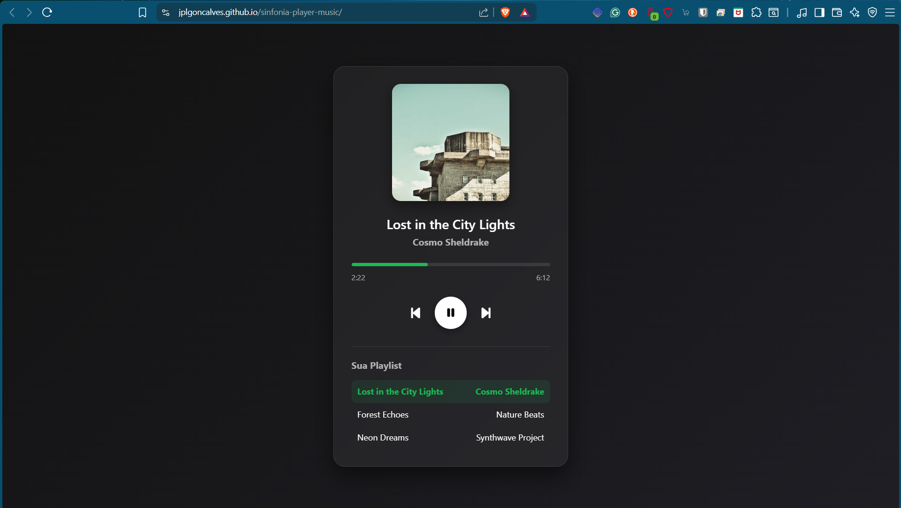

O meu primeiro mini player de música!

Desenvolvi este mini leitor de música minimalista e totalmente funcional diretamente no browser. O objetivo foi criar uma interface limpa, moderna e focada na experiência do utilizador (UX/UI).

O que o projeto inclui:

Totalmente funcional: Permite reproduzir, pausar e navegar pelas faixas da playlist. Design Responsivo & Dark Mode: Uma interface visualmente agradável inspirada nas tendências modernas de streaming.

Tecnologias utilizadas: HTML5 para a estrutura, CSS3 para a estilização/layout e JavaScript para a lógica de controlo de áudio e manipulação do DOM.

